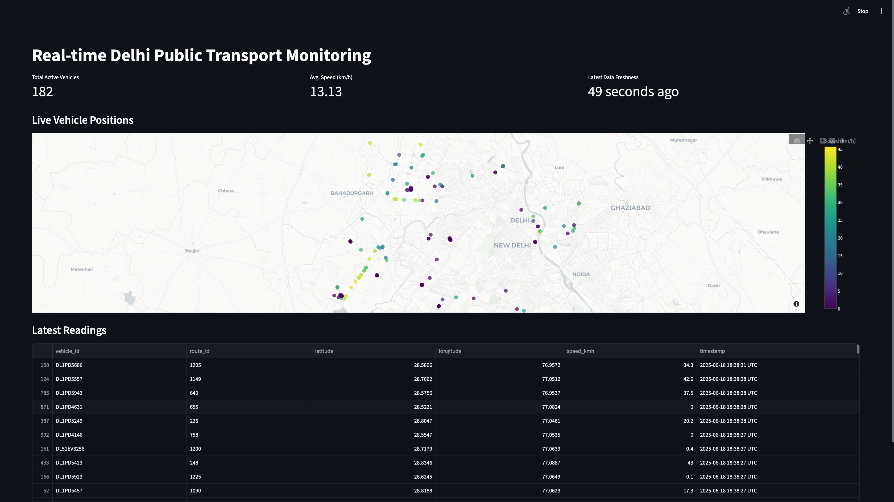
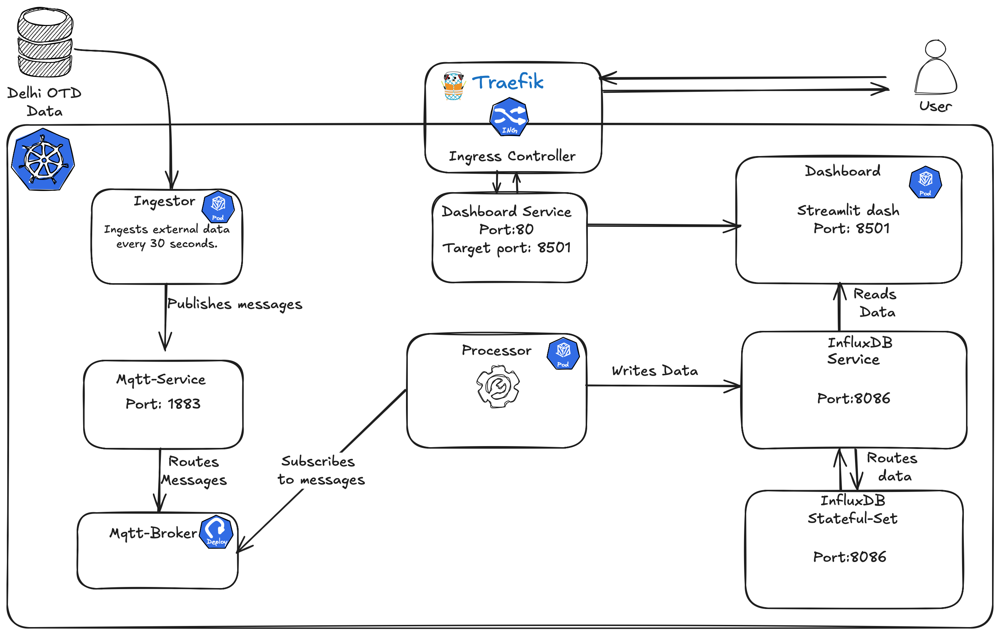

# Real-time Delhi Public Transport Monitoring
[](http://delhirealtime.vishvesh.me)
[](https://opensource.org/licenses/MIT)
[](https://www.google.com/search?q=https://GitHub.com/your-username/your-repo/graphs/commit-activity)
[](https://www.google.com/search?q=https://GitHub.com/your-username/your-repo/commits/main)



## Overview  

This project provides a real-time dashboard for monitoring the Delhi public transport system. It ingests live vehicle position data, stores it in InfluxDB, processes it to calculate metrics like speed, and visualizes the information on an interactive map and a tabular dashboard using Streamlit.

## Key Features

  * **Real-time Vehicle Tracking:** Displays the current location of public transport vehicles on a map of Delhi.
  * **Speed Calculation:** Calculates and displays the real-time speed of each vehicle.
  * **Route Identification:** Shows the assigned route ID for each vehicle.
  * **Key Performance Indicators (KPIs):** Provides at-a-glance metrics such as:
      * Total active vehicles.
      * Average speed of all active vehicles.
      * Latest data freshness.
  * **Tabular Data View:** Presents the latest readings (vehicle ID, route, location, speed, timestamp) in a sortable table.
  * **Historical Data Storage:** Utilizes InfluxDB for storing historical vehicle position data (configured with a 2-day retention policy).
  * **Containerized Deployment:** All components are containerized using Docker for easy deployment and management in Kubernetes.

## Architecture

The project consists of the following main components:

  * **Ingestor:** (Python) Fetches live vehicle position data from an external API, transforms it, and publishes it to an MQTT broker.
  * **MQTT Broker:**  A lightweight message broker that facilitates communication between the Ingestor and the Processor.
  * **Processor:** (Python) Subscribes to the MQTT broker, consumes vehicle position messages, and writes the data into the InfluxDB time-series database.
  * **InfluxDB:** A time-series database used to store the historical vehicle position data.
  * **Dashboard:** (Streamlit/Python) Queries InfluxDB for the latest vehicle data and presents it on a real-time web dashboard.
  * **Ingress (via Traefik):** Provides external access to the Dashboard service running in Kubernetes.

## Getting Started

These instructions will guide you on how to deploy and run the application in a Kubernetes environment.

### Prerequisites

  * **Kubernetes Cluster:** You need a running Kubernetes cluster (e.g., Minikube, Kind, a cloud-based Kubernetes service like AKS, EKS, GKE).
  * **Helm:** Helm, the package manager for Kubernetes, is used for deploying the application.
  * **kubectl:** The Kubernetes command-line tool.
  * **InfluxDB Token:** You will need an InfluxDB API token with write access for the Processor and read access for the Dashboard.
  * **API Key (for Ingestor):** An API key for the external Delhi public transport data source (if required).
  * **Docker:** Docker is needed to build the container images.

### Deployment Steps

1.  **Clone the Repository**

2.  **Configure Helm Values:**
    Create a `values.yaml` file to configure the application parameters, such as:

      * InfluxDB connection details (URL, organization, bucket, token secret name).
      * MQTT broker details (host, port).
      * API key secret name (for the Ingestor).
      * Docker image tags.
      * Replica counts for Deployments.
      * Ingress configuration (hostname).


3.  **Create Kubernetes Secrets:**
    Create Kubernetes Secrets to store API keys and InfluxDB tokens.

    **Example:**
    ```bash
    kubectl create secret generic influxdb-token --namespace default --from-literal=token="YOUR\_INFLUXDB\_TOKEN"
    kubectl create secret generic delhi-otd-api-key --namespace default --from-literal=key="YOUR\_DELHI\_OTD\_API\_KEY"
    ```

4.  **Deploy using Helm:**
    Navigate to the root of th repository (where `Chart.yaml` is located) and deploy the application using Helm:
    ```bash
    helm upgrade --install realtime-app ./charts -n default --values values.yaml
    ```

## Contributing

Contributions are welcome! Please follow these guidelines:

1.  Fork the repository.
2.  Create a new branch for your feature or bug fix.
3.  Make your changes and commit them.
4.  Push your changes to your fork.
5.  **Submit a pull request.**

## License

This project is licensed under the [MIT License](https://www.google.com/search?q=LICENSE).

## Acknowledgements

  * The developers and maintainers of InfluxDB.
  * The developers and maintainers of Streamlit.
  * The developers and maintainers of the MQTT broker Eclipse Mosquitto.
  * The provider of the Delhi public transport data API.


-----
